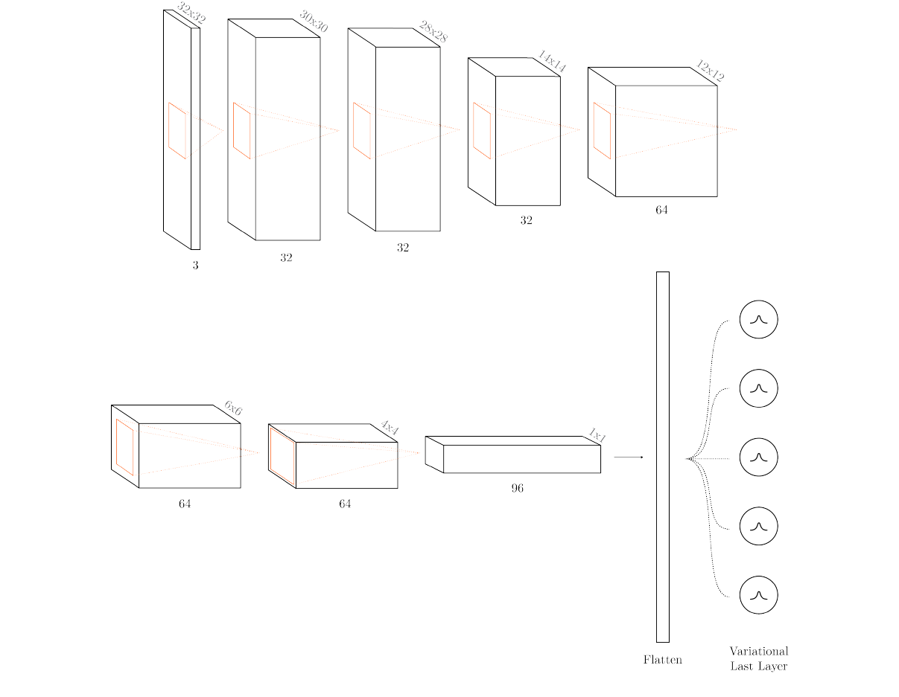
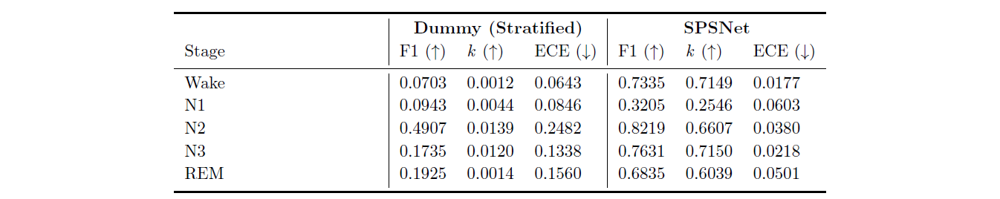

> **SPSNet: a Semi-Probabilistic Convolutional Neural Network for Sleep Stage Classification**  
> Trinity College Dublin, Master of Science in Computer Science (Intelligent Systems)  
> MSc (Hons) Thesis (I.I)

#### Motivation
This study investigates the application of a semi-probabilistic deep learning model for automated sleep stage classification, balancing accuracy with uncertainty quantification. The research introduces SPSNet, a novel architecture combining convolutional neural networks for feature extraction with a Bayesian last layer for probabilistic outputs.

#### Implementation
##### Model Architecture

The network structure consists of three main components: an input layer, a core convolutional block, and an output layer. The input layer utilises a 2D convolutional operation with 32 output channels, transforming the initial 3-channel image input into a higher-dimensional feature representation. This is followed by a ReLU activation function to introduce non-linearity. 

The core of the network is composed of a series of convolutional layers, each followed by ReLU activations. This sequence of layers progressively reduces the spatial dimensions of the feature maps while increasing the number of channels, effectively capturing hierarchical features from the input image. The architecture employs a mix of strided and non-strided convolutions to achieve downsampling, balancing the trade-off between spatial resolution and computational efficiency.
  
The convolutional layers in the core block are structured to gradually increase the receptive field and abstract the features. Starting with 32 channels, the network expands to 64 and then 96 channels in the deeper layers. This expansion in the number of channels allows the model to capture more complex and diverse features as the information propagates through the network. A key aspect of this architecture is the use of multiple convolutional layers with varying strides and kernel sizes. This design choice enables the network to capture hierarchical features, which is crucial for accurate image classification. The alternating use of stride-1 and stride-2 convolutions provides a balance between feature extraction and spatial downsampling, allowing the model to maintain important spatial information.

The output layer of the network incorporates a flattening operation followed by a specialised DiscClassification layer (Harrison et al., 2024). This layer implements a variational approach, introducing probabilistic elements into the classification process. The use of a variational last layer enables the model to output not just point estimates but probability distributions over the class labels. The DiscClassification layer is configurable through several hyperparameters, including regularisation weight, parameterisation method, and prior scale. These parameters allow fine-tuning of the probabilistic behaviour of the model, balancing between the data fit and the prior assumptions about the distribution of the outputs.

#### Performance

Wake and N2 stages show the highest F1 scores at 73.35% and 82.19% respectively. The N3 and REM stages also demonstrates good performance with an F1 score of 76.31% and 68.35% respectively. However, the model struggles with the N1 stage, showing an F1 score of 32.05%. This is consistent within the sleep staging literature; N1 has traditionally been the most challenging class to identify. 

Interestingly, the model shows a tendencies to misclassify N1 as REM as highlighted in Table 6.2, suggesting a challenge in distinguishing between these two stages. This is not entirely surprisingly given that both N1 and REM are characterised by low-amplitude, mixed-frequency EEG patterns. The wake stage also sees some misclassifications as N1 (17.01%) and REM (13.56%), which may be attributed to similarities in EEG patterns during drowsy wakefulness and light sleep stages. In terms of Cohen’s Kappa, agreement with the expert’s labels is substantial (0.6-0.8) for Wake, N2, N3, and REM stages, while N1 is fair (0.2-0.4) (McHugh, 2012).

#### References
- Harrison, J., Willes, J., and Snoek, J. (2024). Variational Bayesian Last Layers. arXiv:2404.11599 [cs, stat].
